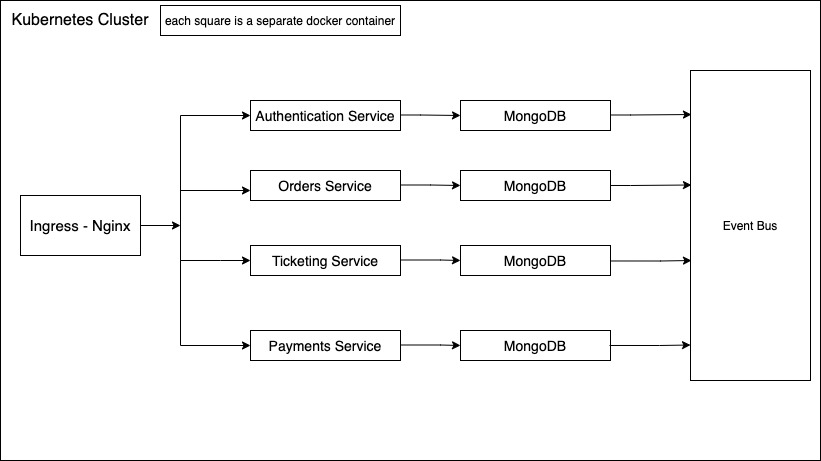
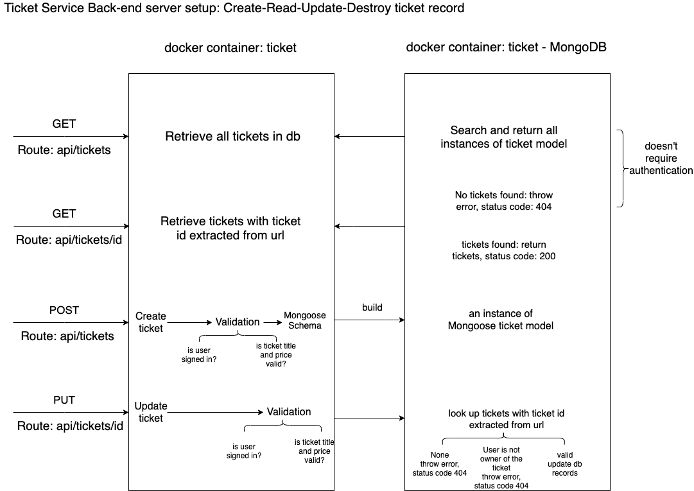

# Ticketing_app
This Event-ticketing application is designed based on asynchronous event-based microservice architecture. It will enable users to list events for sale,
purchase listed tickets, lock/unlock tickets during purchasing process and edit ticket prices etc. 

Backend structure Overview 

Ticket service back-end server setup 

